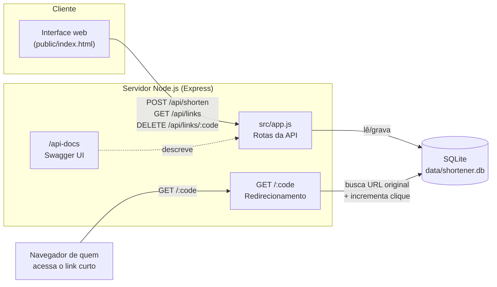

# URL Shortener

Encurtador de URLs: Node.js + Express + SQLite (`better-sqlite3`), com interface web, documentação OpenAPI/Swagger e testes automatizados.

## Arquitetura



- **`src/app.js`** — define as rotas Express (API + redirecionamento). Exportado sem `listen()`, para poder ser testado com Supertest.
- **`src/server.js`** — importa o `app` e sobe o servidor HTTP.
- **`src/db.js`** — conexão com o SQLite e criação da tabela `links`.
- **`public/index.html`** — interface web estática que consome a API via `fetch`.
- **`openapi.yaml`** — especificação OpenAPI 3.0 da API, servida em `/api-docs` via Swagger UI.

## Rodando localmente

Pré-requisito: Node.js 20+.

```
cd url-shortener
npm install
npm start
```

- Aplicação: `http://localhost:3000`
- Documentação interativa da API (Swagger UI): `http://localhost:3000/api-docs`

Para desenvolvimento com reload automático: `npm run dev`.

## Rodando com Docker

```
docker compose up --build
```

Sobe em `http://localhost:3000` com o banco SQLite persistido na pasta `./data` do host (via volume).

Alternativa sem docker-compose:

```
docker build -t url-shortener .
docker run -p 3000:3000 -v "${PWD}/data:/app/data" url-shortener
```

## Testes

Testes de integração da API com **Jest + Supertest**, usando um banco SQLite em memória (não afeta `data/shortener.db`):

```
npm test
```

Cobrem: criação de link (com e sem alias), validação de URL/alias, conflito de alias duplicado, listagem, redirecionamento com contagem de cliques e remoção de links.

## Endpoints

| Método | Rota | Descrição |
|---|---|---|
| `POST` | `/api/shorten` | Cria um link curto. Body: `{ "url": "https://...", "customCode": "opcional" }` |
| `GET` | `/api/links` | Lista todos os links criados |
| `DELETE` | `/api/links/:code` | Remove um link |
| `GET` | `/:code` | Redireciona para a URL original e contabiliza o clique |

Documentação completa e interativa (schemas, exemplos, "try it out"): `/api-docs`.

## Configuração

| Variável | Descrição | Padrão |
|---|---|---|
| `PORT` | Porta do servidor | `3000` |
| `BASE_URL` | URL base usada para montar os links curtos | `http://localhost:<PORT>` |
| `DB_PATH` | Caminho do arquivo SQLite (`:memory:` para banco em memória) | `data/shortener.db` |

## Uso de IA

Este projeto foi desenvolvido com apoio do Claude Code (Anthropic) como ferramenta de programação assistida por IA: geração do código do backend (Express + SQLite), da interface web, dos testes, da documentação OpenAPI e da containerização com Docker. As decisões de arquitetura, revisão e validação foram conduzidas pelo autor do repositório.
