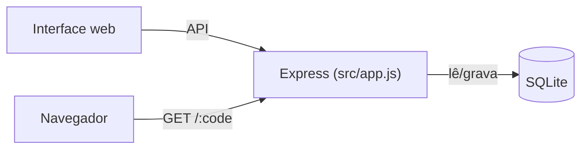

# URL Shortener

Encurtador de URLs: Node.js + Express + SQLite, com interface web, documentação OpenAPI/Swagger e testes automatizados.

## Arquitetura



- `src/app.js` — rotas Express (API + redirecionamento)
- `src/server.js` — sobe o servidor HTTP
- `src/db.js` — conexão SQLite
- `public/index.html` — interface web
- `openapi.yaml` — spec da API, servida em `/api-docs`

## Rodando

**Local** (Node.js 20+):
```
npm install
npm start
```

**Docker**:
```
docker compose up --build
```

Em ambos: app em `http://localhost:3000`, docs interativas em `/api-docs`.

## Testes

```
npm test
```

Testes de integração (Jest + Supertest) cobrindo criação, validação, conflito de alias, listagem, redirecionamento e remoção de links.

## Endpoints

| Método | Rota | Descrição |
|---|---|---|
| `POST` | `/api/shorten` | Cria um link. Body: `{ "url", "customCode"? }` |
| `GET` | `/api/links` | Lista os links |
| `DELETE` | `/api/links/:code` | Remove um link |
| `GET` | `/:code` | Redireciona e conta o clique |

## Configuração

`PORT` (padrão `3000`), `BASE_URL` (padrão `http://localhost:<PORT>`), `DB_PATH` (padrão `data/shortener.db`, use `:memory:` para banco volátil).

## Uso de IA

Projeto desenvolvido com apoio do Claude Code (Anthropic): geração de código, testes, documentação e containerização. Arquitetura, revisão e validação conduzidas pelo autor.
